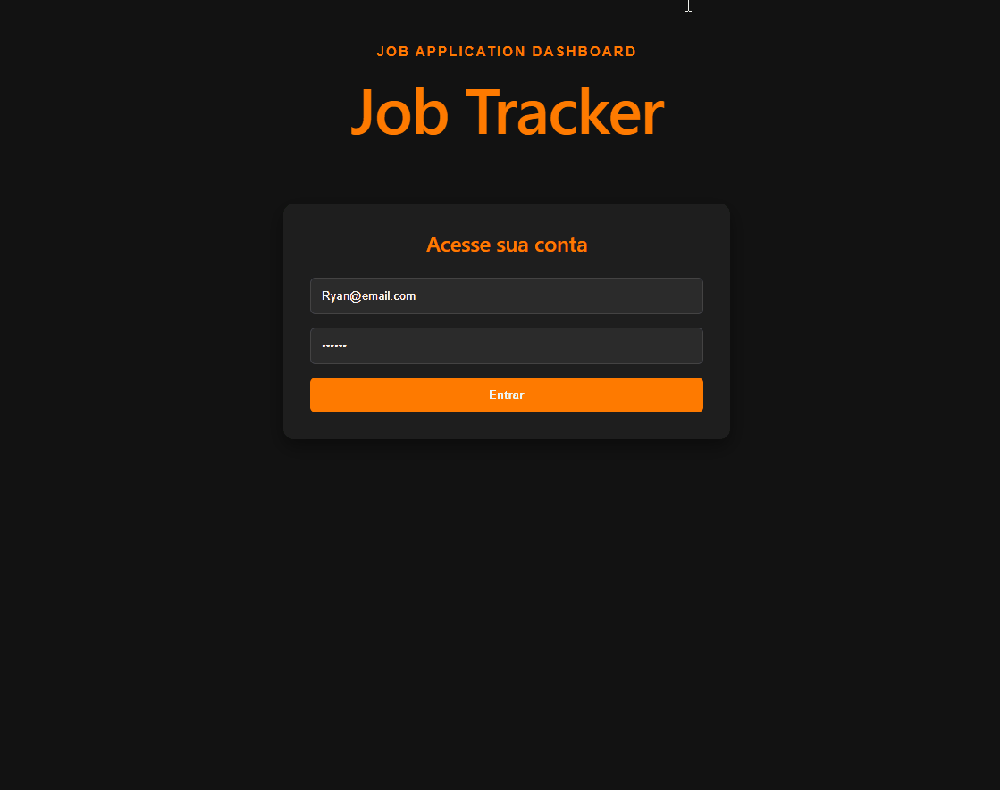
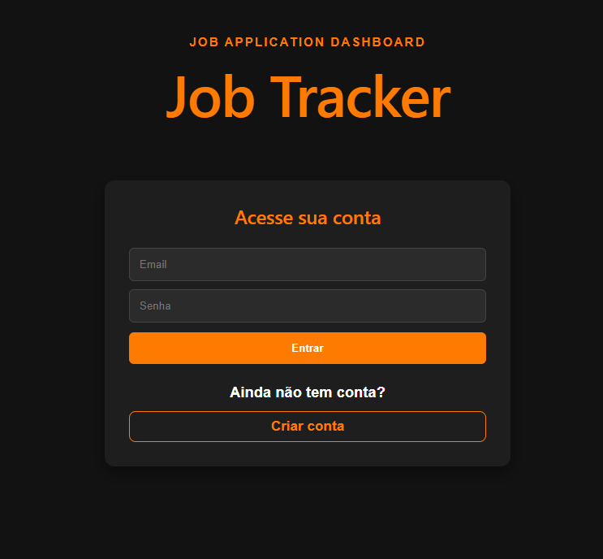
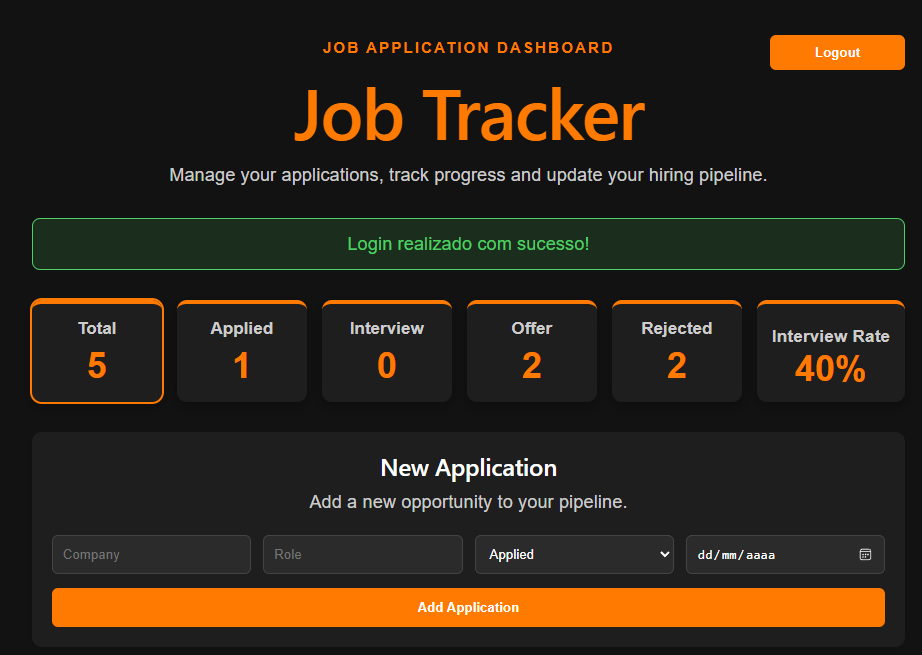
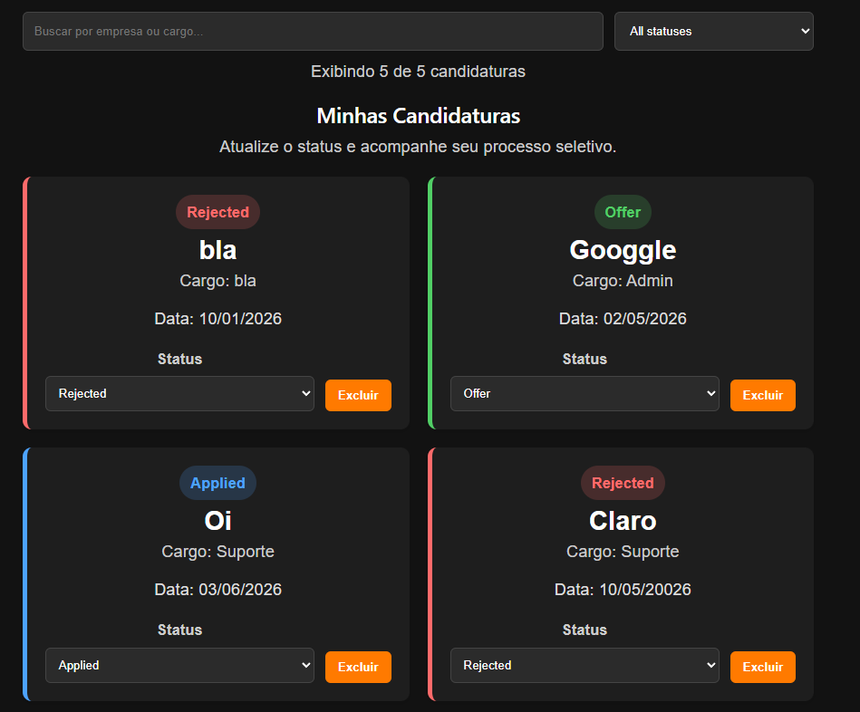

# 📋 Job Application Tracker

A full-stack web application that helps users organize and track job applications throughout the hiring process — from application to interview, offer, or rejection.

Built as a **portfolio project** to demonstrate practical full-stack development skills with React, Node.js, Express, PostgreSQL, JWT authentication, and REST APIs.

---

## 🎬 Demo



---

## ⚡ 10-Second Overview

* Full-stack application with React, Node.js, Express and PostgreSQL
* JWT authentication system
* Complete CRUD for job applications
* Dashboard with application statistics
* Clickable status cards for quick filtering
* Search by company or role
* Status filtering and status update directly from each card
* Dark theme responsive UI

---

## ✨ Features

### 🔐 Authentication

* User login
* JWT-based authentication
* Protected routes
* Persistent login using localStorage

### 📊 Job Tracking

* Create job applications
* View all registered applications
* Update application status
* Delete applications
* Track application status:
  `Applied → Interview → Offer → Rejected`

### 📈 Dashboard

* Total applications count
* Applications by status
* Interview rate calculation
* Clickable dashboard cards to filter applications quickly

### 🔎 Search and Filters

* Search applications by company
* Search applications by role
* Filter applications by status
* View how many applications are currently displayed

### 🎨 User Interface

* Dark theme layout
* Responsive cards
* Status badges
* Visual status indicators
* Success messages after actions
* Confirmation before deleting applications

---

## 🛠 Tech Stack

### Frontend

* React
* Vite
* JavaScript
* CSS

### Backend

* Node.js
* Express.js
* JWT Authentication
* bcrypt

### Database

* PostgreSQL

---

## 🧩 Architecture Overview

```txt
Frontend (React)
        ↓
REST API (Node.js + Express)
        ↓
PostgreSQL Database
```

The project follows a basic full-stack architecture with separated frontend and backend folders, REST API communication, authentication middleware, and relational database integration.

---

## 📸 Screenshots

### Login Page



### Dashboard



### Job Applications



---

## 📁 Project Structure

```txt
PJobApplicationTracker/
│
├── frontend/
│   ├── src/
│   │   ├── components/
│   │   │   ├── LoginForm.jsx
│   │   │   ├── JobForm.jsx
│   │   │   └── JobList.jsx
│   │   │
│   │   ├── services/
│   │   │   └── api.js
│   │   │
│   │   ├── App.jsx
│   │   └── App.css
│   │
│   └── package.json
│
├── backend/
│   ├── controllers/
│   ├── database/
│   ├── middleware/
│   ├── models/
│   ├── routes/
│   ├── server.js
│   └── package.json
│
├── assets/
│   ├── demo.gif
│   ├── login.png
│   ├── dashboard.png
│   └── jobs.png
│
├── .gitignore
└── README.md
```

---

## 📋 Prerequisites

Before running this project, make sure you have installed:

* Node.js
* npm
* PostgreSQL
* Git

---

## 🚀 Installation & Setup

### 1. Clone the repository

```bash
git clone https://github.com/Ryluna19/PJobApplicationTracker.git
cd PJobApplicationTracker
```

---

### 2. Database setup

Create a PostgreSQL database:

```sql
CREATE DATABASE jobtracker;
```

Create the users table:

```sql
CREATE TABLE users (
  id SERIAL PRIMARY KEY,
  name VARCHAR(100),
  email VARCHAR(100) UNIQUE NOT NULL,
  password TEXT NOT NULL
);
```

Create the jobs table:

```sql
CREATE TABLE jobs (
  id SERIAL PRIMARY KEY,
  company VARCHAR(100) NOT NULL,
  role VARCHAR(100) NOT NULL,
  status VARCHAR(50) NOT NULL,
  application_date DATE,
  user_id INTEGER REFERENCES users(id) ON DELETE CASCADE
);
```

---

### 3. Backend setup

Go to the backend folder:

```bash
cd backend
npm install
```

Create a `.env` file inside the `backend` folder:

```env
DB_USER=your_postgres_user
DB_HOST=localhost
DB_NAME=jobtracker
DB_PASSWORD=your_postgres_password
DB_PORT=5432

JWT_SECRET=your_secret_key
PORT=5000
```

Run the backend server:

```bash
npm run dev
```

The backend will run on:

```txt
http://localhost:5000
```

---

### 4. Frontend setup

Open another terminal and go to the frontend folder:

```bash
cd frontend
npm install
```

Run the frontend:

```bash
npm run dev
```

The frontend will run on:

```txt
http://localhost:5173
```

---

## 🔌 API Endpoints

### Authentication

| Method | Endpoint    | Description                     |
| ------ | ----------- | ------------------------------- |
| POST   | `/register` | Register a new user             |
| POST   | `/login`    | Login user and return JWT token |

### Jobs

| Method | Endpoint    | Description                          |
| ------ | ----------- | ------------------------------------ |
| GET    | `/jobs`     | Get all jobs from authenticated user |
| POST   | `/jobs`     | Create a new job application         |
| PUT    | `/jobs/:id` | Update job status                    |
| DELETE | `/jobs/:id` | Delete a job application             |

---

## 🗄 Database Schema

### Users Table

| Field    | Type         | Description       |
| -------- | ------------ | ----------------- |
| id       | SERIAL       | Primary key       |
| name     | VARCHAR(100) | User name         |
| email    | VARCHAR(100) | Unique user email |
| password | TEXT         | Hashed password   |

### Jobs Table

| Field            | Type         | Description         |
| ---------------- | ------------ | ------------------- |
| id               | SERIAL       | Primary key         |
| company          | VARCHAR(100) | Company name        |
| role             | VARCHAR(100) | Job role            |
| status           | VARCHAR(50)  | Application status  |
| application_date | DATE         | Date of application |
| user_id          | INTEGER      | Related user ID     |

---

## 🎯 What This Project Demonstrates

This project was built to demonstrate core skills required for entry-level full-stack development roles:

* React component structure
* State management with hooks
* Form handling
* Frontend and backend integration
* REST API development
* Authentication with JWT
* Password hashing with bcrypt
* PostgreSQL relational database usage
* Protected routes
* CRUD operations
* Basic UX improvements
* Git and GitHub workflow

---

## 🚧 Future Improvements

* Add input validation on the backend
* Add pagination for large job lists
* Add charts for dashboard analytics
* Add user registration page on the frontend
* Add automated tests
* Improve error handling
* Deploy frontend and backend
* Export applications to CSV

---

## 👨‍💻 Author

**Ryan Santos**

* GitHub: [Ryluna19](https://github.com/Ryluna19)
* Full-Stack Development: React, Node.js, Express and PostgreSQL
* Seeking internship / junior developer opportunities

---

## 📌 Note

This is a portfolio project built for learning and demonstration purposes.

For production use, improvements such as stronger validation, rate limiting, testing, environment-specific configuration, and deployment pipelines would be recommended.
